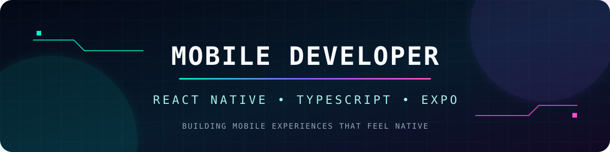

<div align="center">



# Привет, я CMetan-lgtm 👋

### React Native Developer · TypeScript · Mobile Products

Создаю быстрые, доступные и аккуратные мобильные приложения для iOS и Android.

[](https://YOUR_PORTFOLIO_URL)
[](https://YOUR_LINKEDIN_URL)
[](mailto:YOUR_EMAIL)

</div>

---

## `> whoami`

```ts
const developer = {
  name: "YOUR_NAME",
  role: "React Native Developer",
  location: "YOUR_LOCATION",
  focus: ["Mobile UX", "Performance", "Clean Architecture"],
  currentlyLearning: ["Native Modules", "Mobile CI/CD"],
  openTo: ["Mobile projects", "Open source", "Collaboration"]
};
```

## `> tech_stack`

<div align="center">


</div>

## `> featured_projects`

<table>
<tr>
<td width="50%" valign="top">

### 📱 PROJECT_ONE
Кратко опиши проблему, которую решает приложение, и свой вклад.

**Stack:** React Native · TypeScript · Expo

[Repository](https://github.com/CMetan-lgtm/PROJECT_ONE) · [Demo](https://YOUR_DEMO_URL)

</td>
<td width="50%" valign="top">

### ✈️ PROJECT_TWO
Кратко опиши ключевую функцию, архитектуру и достигнутый результат.

**Stack:** React Native · Firebase · Zustand

[Repository](https://github.com/CMetan-lgtm/PROJECT_TWO) · [Demo](https://YOUR_DEMO_URL)

</td>
</tr>
</table>

## `> github_stats`

<div align="center">


</div>

## `> current_focus`

- 📲 Разработка кроссплатформенных приложений на React Native
- ⚡ Оптимизация производительности и времени запуска
- 🧩 Масштабируемая архитектура и переиспользуемые компоненты
- ♿ Доступные и понятные мобильные интерфейсы
- 🚀 Автоматизация сборок, тестирования и публикации

## `> contact`

```text
Portfolio : https://YOUR_PORTFOLIO_URL
LinkedIn : https://YOUR_LINKEDIN_URL
Email    : YOUR_EMAIL
```

<div align="center">


`Code. Ship. Improve. Repeat.`

</div>
